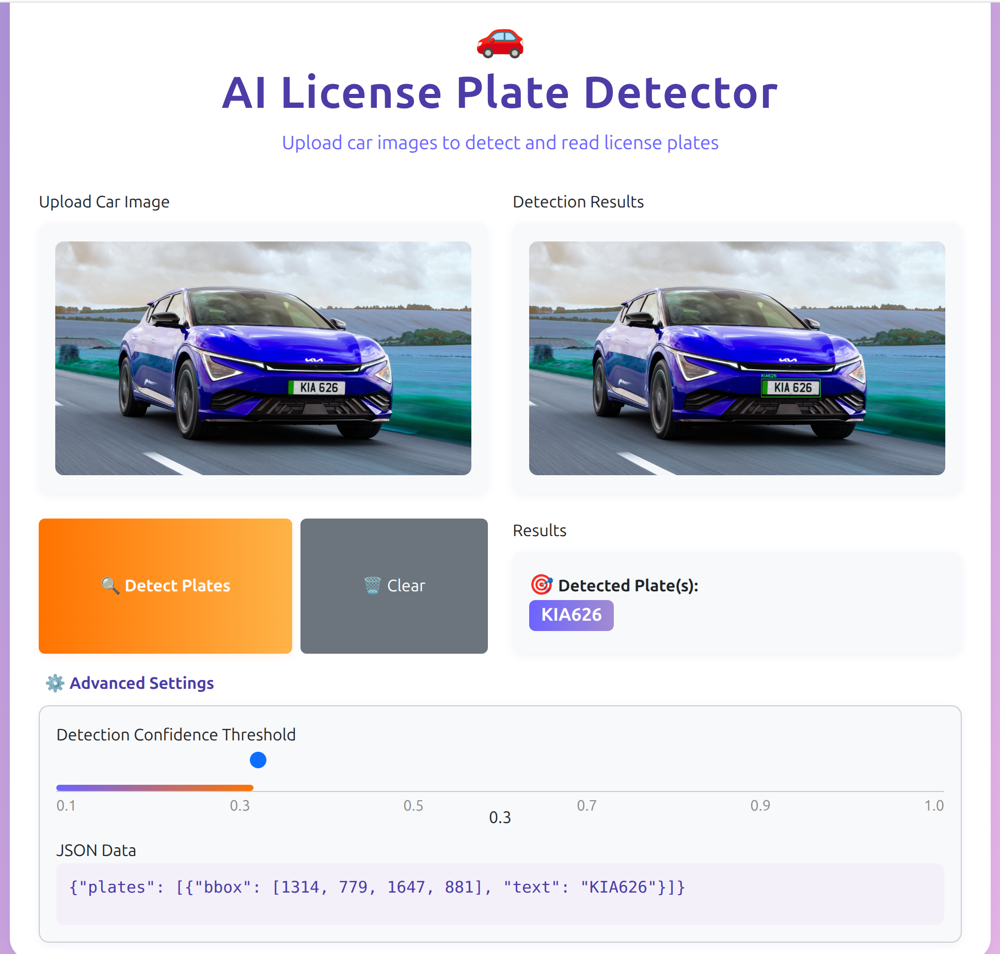

# 🚗 Car License Plate Recognition

An Efficent and easy-to-use web for car license plate detection and recognition using YOLO and EasyOCR, powered by FastAPI.

---

## 🌟 Features

- Upload car images and detect license plates in your browser
- Accurate plate text extraction using EasyOCR
- Adjustable detection confidence threshold
- Clear results and JSON output
- Easy to run locally

---

## 🚀 Quick Start

1. **Clone the repo:**
   ```bash
   git clone https://github.com/AhmedEndrisH/Car_License_Plate_Recognition.git
   cd Car_License_Plate_Recognition
   ```

2. **Install dependencies:**
   ```bash
   pip install -r requirements.txt
   ```

3. **Add your YOLO model file:**
   - Place your `Y11l_best.pt` file in the project root.
   - (Or provide a download link if you want to share a public model.)

4. **Run the app:**
   ```bash
   python main.py
   ```
   The app will be available at [http://localhost:8000](http://localhost:8000)

---

## 🖼️ Example Interface

<!-- ### Screenshot -->



<!-- ### Demo Video -->

<!-- Upload your video to GitHub or YouTube and add the link below -->
<!-- [Demo Video](https://user-images.githubusercontent.com/yourusername/your-demo-video.mp4) -->

---

## 📝 Usage

- Open the web interface in your browser
- Upload a car image and click "Detect Plates"
- View detected plate(s) and results side by side
- Adjust the confidence threshold in Advanced Settings if needed
- Click "Clear" to reset the interface

---

## 🛠️ Tech Stack

- **Backend:** FastAPI, Ultralytics YOLO, EasyOCR, OpenCV, Pillow
- **Frontend:** Jinja2, Bootstrap, HTML/CSS/JS

---

## 📂 Project Structure

```
car_license_plate/
├── main.py
├── requirements.txt
├── README.md
├── templates/
│   └── index.html
├── static/
│   └── (generated images, screenshots, or demo video)
├── Y11l_best.pt
└── .gitignore
```

---


## 📄 License

MIT

---

## 👤 Author

[Ahmed Endris](https://github.com/AhmedEndrisH)

---

